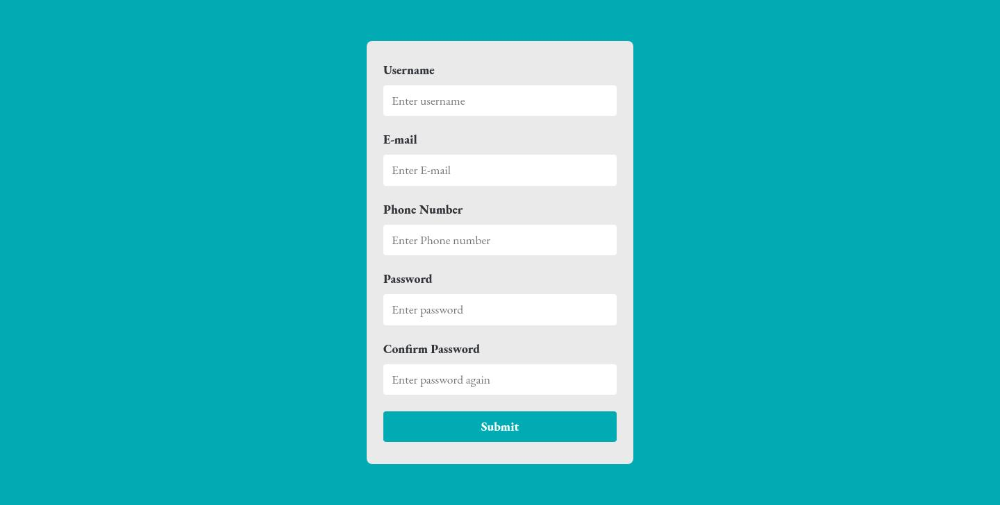

# JS FORM VALIDATION

## Welcome! 👋

This web ui is done using HTML, CSS and JS. In this small project you will learn form validation based on Javascript.
## Tech Stack

**Client:** HTML, CSS, JS

## Deployment

Deploy this project on Github Pages / Vercel / Netlify.

**Live URL:** https://priyanshusharma0326.github.io/Javascript-Form-Validation/